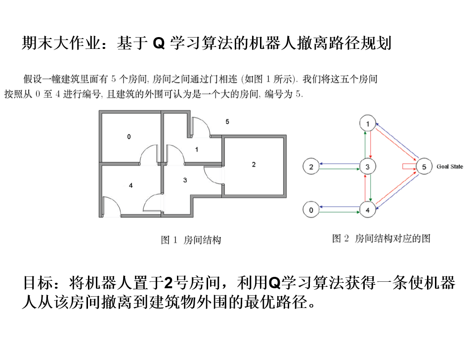
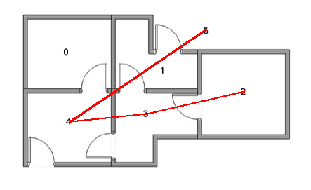
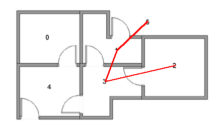

# 使用Q-Learning求解有限状态机任意状态中到吸收态的最优策略


## 问题分析
状态空间和动作空间均离散，可使用矩阵作为状态转移的函数

$(s,a)\overset{f}{\rightarrow}(s',r)$

*理论上是这样，但是这里直接把每一步的reward都设置为-1了，
因此矩阵中每个元素都仅仅是s'而不是(s',r)*

## 问题建模

该问题是model-based还是model-free的界限并不分明。

状态空间初始状态和终止状态是确定的

动作空间如果采用上左下右四个方向的话也是确定的


## 算法细节
### 动作选择

由于问题规模太小，不适宜采用UCB行为选择，而是使用了$\epsilon-greedy$方法

a|P
-|--
$\underset{a}{\argmax} q(s,a)$|$1-\epsilon$
随机|$\epsilon$

禁用explore可以设置epsilon为0,但使得可读性更高的选择是使用if语句
```python
def choose_action(self, state, explore=True):
    """
    根据当前状态选择动作
    以epsilon的概率选择探索
    以1-epsilon的概率选择利用
    """
    if explore and random.uniform(0, 1) < self.epsilon:
        # 以epsilon的概率随机选择动作（探索）
        action = random.randint(0, self.env.action_space_num - 1)
    else:
        # 选择当前策略下的最佳动作（利用）
        action = np.argmax(self.q_table[state])
    return action
```
最终输出时不用探索

### 状态转移
因为我们的目标只有找到出口，为了尽量让算法更加model-free：
* 除了终点以外的每个S-A对的reward全部设置为-1
* 每个状态可选择的动作空间都是完整的
```python
def step(self, action):
    """在当前状态采取行动，得到奖励和下一状态"""
    next_state = self.transitions[self.state][action]

    reward = -1  # 每步都给予负奖励
    if next_state == self.goal_state:
        reward = 100  # 到达目标状态获得正奖励
        done = True
    else:
        done = False

    self.state = next_state
    self.path.append(next_state)
    return next_state, reward, done
```
### 更新Q值
基于Bellman Equation：
$Q^*(s, a) = \mathbb{E}\[r + \gamma \max_{a'} Q^*(s', a') | s, a\]$

可使用如下规则，它收敛到Q*：

$Q(s_t, a_t) \leftarrow Q(s_t, a_t) + \alpha \[r_{t+1} + \gamma \max_{a'} Q(s_{t+1}, a') - Q(s_t, a_t)\]$
```python
def update_q_table(self, state, action, reward, next_state):
    alpha = self.alpha
    gamma = self.gamma
    old_value = self.q_table[state, action]
    next_max = np.max(self.q_table[next_state])
    new_value = (1 - alpha) * old_value + alpha * (reward + gamma * next_max)
    self.q_table[state, action] = new_value
```
### 训练
Qlearning是off-policy的，所以要手动保存最优策略
```python
def train(self, episodes: int):
    for episode in range(episodes):
        reward, path = self.play()
        if reward > self.best_reward:
            self.best_path = path
            self.best_reward = reward
```
### 输出
还是因为off-policy的原因，我们需要在训练结束后根据Q表完全贪心地走一趟

```python
def show(self):
    """保存结果"""
    log_dir = f'log/{self.seed}'
    if not os.path.exists(log_dir):
        os.makedirs(log_dir)

    # 创建或打开一个日志文件
    log_file_path = os.path.join(log_dir, 'output.log')
    with open(log_file_path, 'w') as log_file:
        # 重定向标准输出
        import sys
        original_stdout = sys.stdout
        sys.stdout = log_file

        print('q_table:')
        print(self.q_table)
        reward, path = self.play(explore=False)
        print('reward:', reward)

        # 恢复标准输出
        sys.stdout = original_stdout
    self.env.render(path, log_dir)
```

## 结果展示


